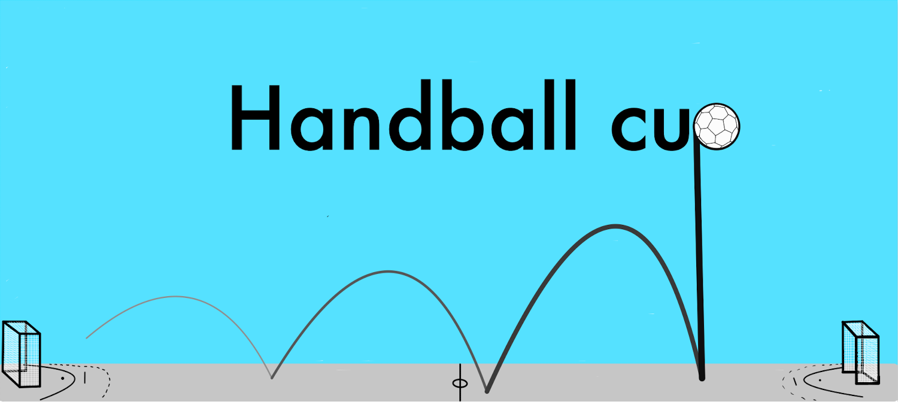

# Handball Cup
Handball Cup is a ***easy-to-use*** application that is used to sets up a ***tournament***.

### Key Features
 - Registrate tournaments
 - Register teams
 - Show all tournaments
 - Autogeneration of match set up
 - Visual presentation of match setup as brackets
### Demo

### Installation 
Click [***HERE***](https://gitlab.stud.idi.ntnu.no/G1-06/idatt-1002-2022-1-06/-/archive/master/idatt-1002-2022-1-06-master.zip) to downlad the zip file for the application. Then follow instructions in [Installation Guide](https://gitlab.stud.idi.ntnu.no/G1-06/idatt-1002-2022-1-06/-/wikis/Home/System/Installation%20Guide)

### USAGE
This application 
